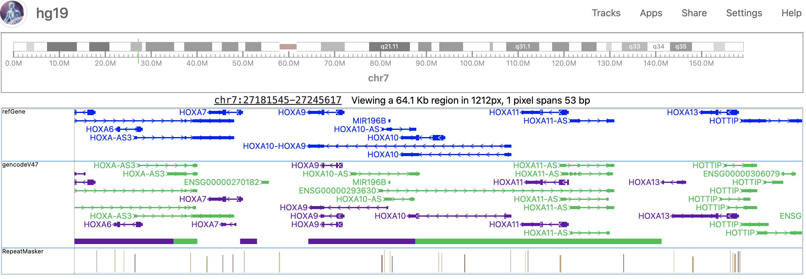
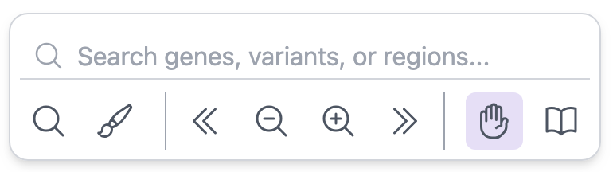

# User interface

The main user interface is trying to maxmize the visualization area of data tracks.

1. Top left is the icon for the current genome, and it also serves the function for switching genomes and session managers.
2. Top right is the main menu, which will be described in the next section.
3. Below is the genome navigator, user can select a region in the genome and the Browser will jump to that region when user releases the mouse.
4. The main visualization area with a small paragraph above tells the viewing region information.

5. There is a floating bar at the bottom middle for switching tools, searching genes, control highlighting areas etc.

