# Main menu

The main menu is located at the top right, used to control Tracks, access to Apps and other resources.

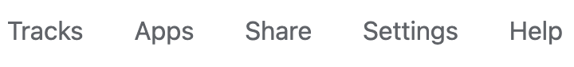

## Tracks menu

The browser collects data from large corsortia like Roadmap Epigenomics, ENCODE, 4DN, TaRGET, etc. The data are called public data/tracks and are organized into different collections called hubs. Along with these public hubs and tracks users can submit their own custom tracks and data hubs to allow for easy comparison. Tracks menu is used to load more tracks.

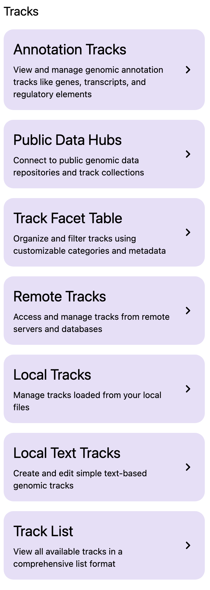

### Add tracks from public hubs

From the Tracks menu choose Public Data Hubs. This will display all of the public data hubbs available for the species and build you are currently working in. For example, using human hg19 genome the Roadmap Epigenomics hub as example. Click the `+` button to load this hub:

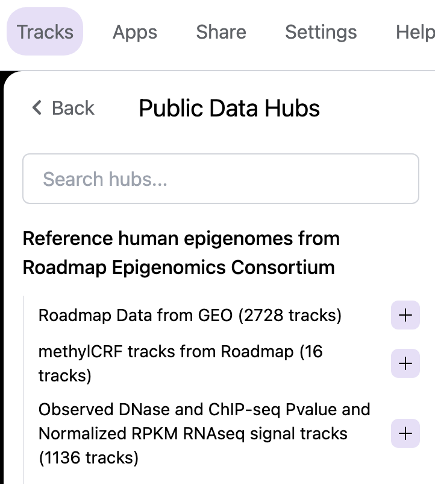

After loading of this hub, default tracks of this hub will be displayed:

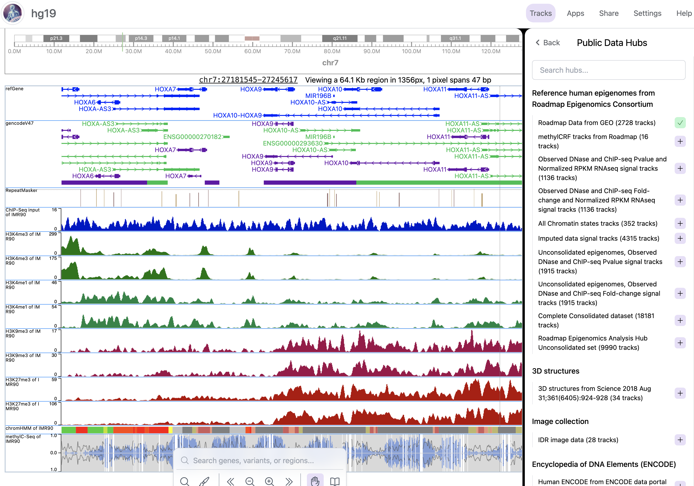

After a hub is added, a facet table containing all tracks will pop up. This allows you to choose any tracks you are interested in. The facet table can also be revisted through the menu when you choose Track Facet Table:

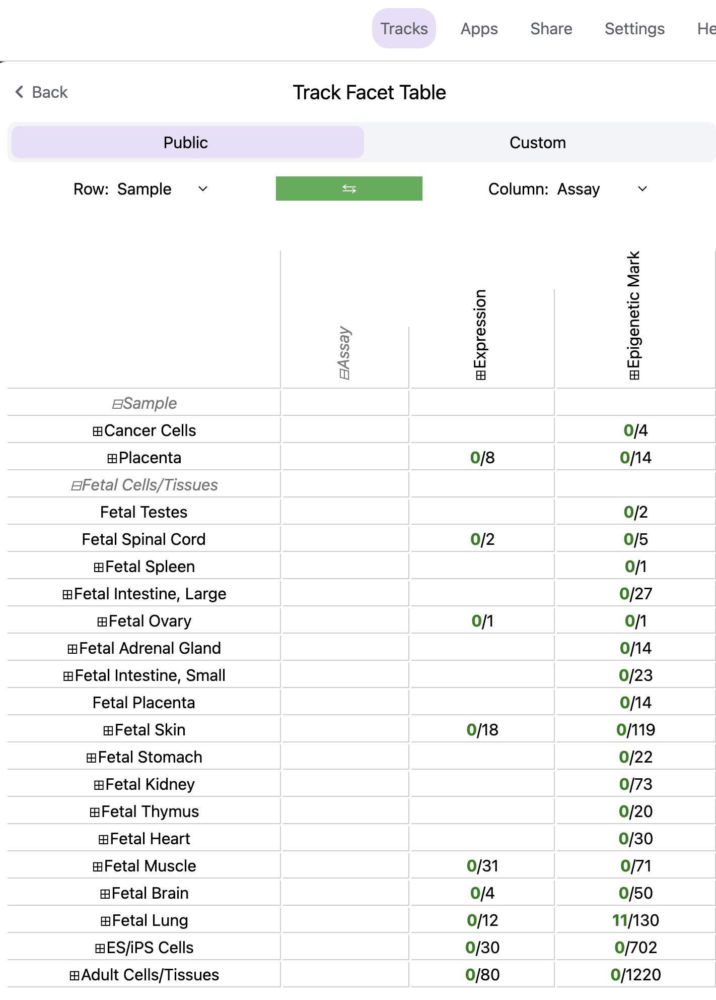

You can expand the row and/or column selection by clicking the + buttons. Row and column displays can also be easily swapped:

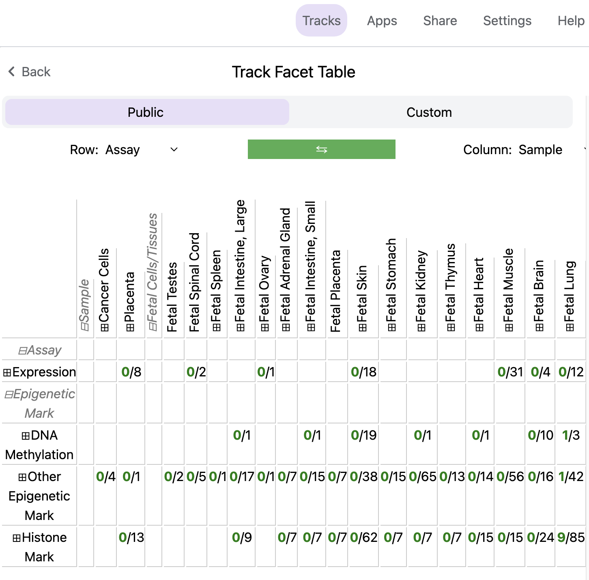

### Adding annotation tracks

Users can add numerous annotation tracks from the Tracks menu by choosing Annotation Tracks.

Tracks are grouped into different groups and can be added to the browser. The tracks include CpG island information, repeat information, G/C content information, and conservation information to name a few. A green check mark means the track is added.

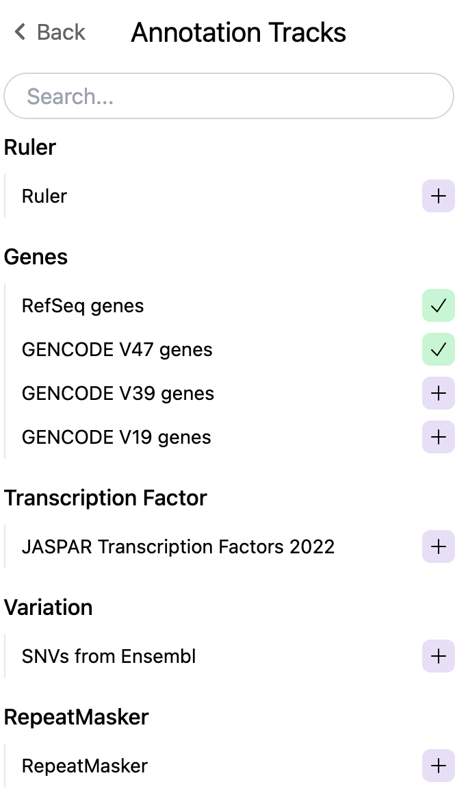

### Adding a custom track or data hub

Users can also submit their own track as a custom track. For example, say we have a bigWig track located at `https://vizhub.wustl.edu/public/tmp/TW463_20-5-bonemarrow_MeDIP.bigWig` . From the Tracks menu choose Custom tracks and a custom track interface will pop up. Fill in the track type, label, and URL before clicking the green Submit button:

Adding a custom data hub is similar to the steps above. For example, say you have a hub located at `https://vizhub.wustl.edu/public/tmp/a.json` . From the Tracks menu choose Custom tracks, switch to the Add custom data hub tab, paste the URL of your hub, and then click the green Load From URL button. from URL.

The tracks within the custom hub can then be added from the generated facet table.

Note

Tracks from custom hubs are hidden by default as users may submit a hub contains hundreds of tracks. Users should add tracks that they want from the facet table.

You can also load a local data hub file in JSON format from your computer using the file upload interface, right below the URL submit hub interface.

### Track Customization

Tracks can be customized in a multitude of manners.

#### Selecting Tracks

An indivdual track can be selected by simply right clicking on the tracking on the track. Multiple tracks can be selected by either holding the shift button and left clicking on each track or by holding shift and left clicking on a shared metadata term of consecutive tracks. In this manner, multiple tracks can be customized or moved at the same time. To deselect the tracks simply right click and press the button Deselect # tracks .

#### Track Color

Right clicking on annotation and numerical tracks will display `Primary Color`, `Secondary Color`, and `Background Color` which can all be customized using the color picker. For `methylC` tracks and `categorical` tracks the Color and Background of each class of elements (e.g. CG, CHG, and CHH) can be personalized. Additionally, for `methylC` tracks the `Read depth` line color can be customized.

#### Track Height

For each track the height can be customized by right clicking on the track and typing in a number to the panel. At 20 pixels and below for numerical tracks the track will display as a heatmap.

#### Track Display Mode

For each numerical, annotation, or BAM track the display can be changed to `DENSITY` or `FULL` mode by right clicking on the track.

#### Track Y-axis Scale

For each numerical track the y-axis can be displayed in `AUTO` or `FIXED` mode by right clicking on the track. The `AUTO` mode will scale the axis based on numerical values in the immediate area of the view range. The `FIXED` mode allows the user to select a Y-Axis min or Y-axis max. For values above the set max the Primary color above max can be set for easy viewing. For values below the set minimum the Primary color below min can bet set.

#### Track Information

If details were specified for a track in the data hub file these can be viewed by right clicking on the sample and clicking on the arrow to the right. An easy access copy but is also available to copy the URL for the track.

## Apps menu

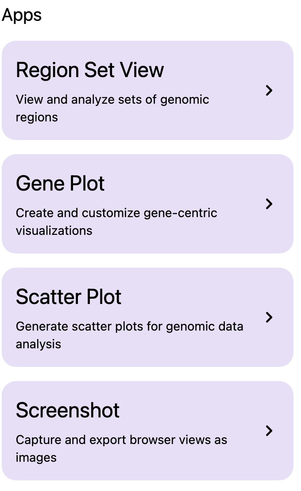

## Share menu

Share menu can be used to send the current view by email or share a link, or QR code.

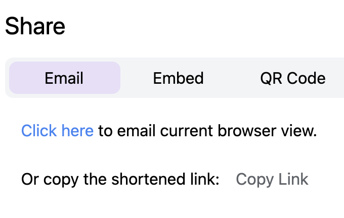

## Settings menu

Setting menu is used to toggle the display of genome navigator.
(more setting items will be added)

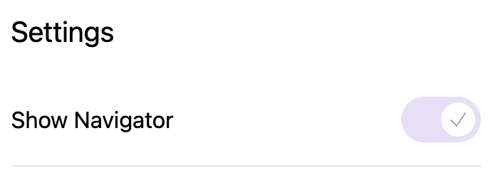

## Help menu

Help menu contains links to this documentation, to the previous version of the browser, to the legacy browser, to our Discord server and Github repository etc.

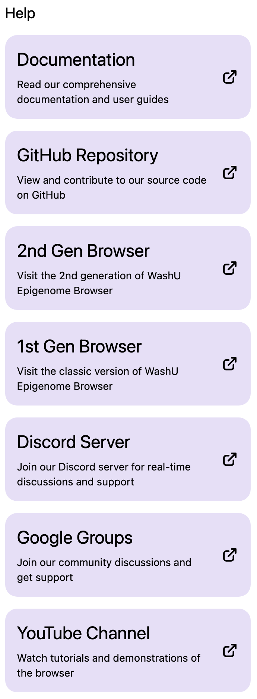
