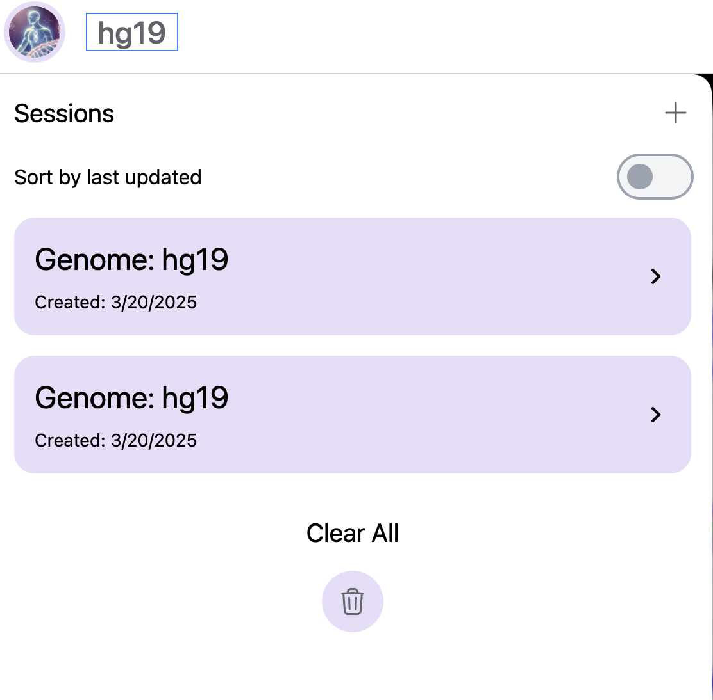
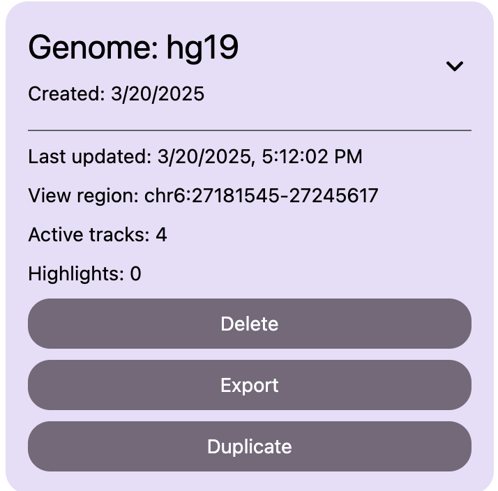
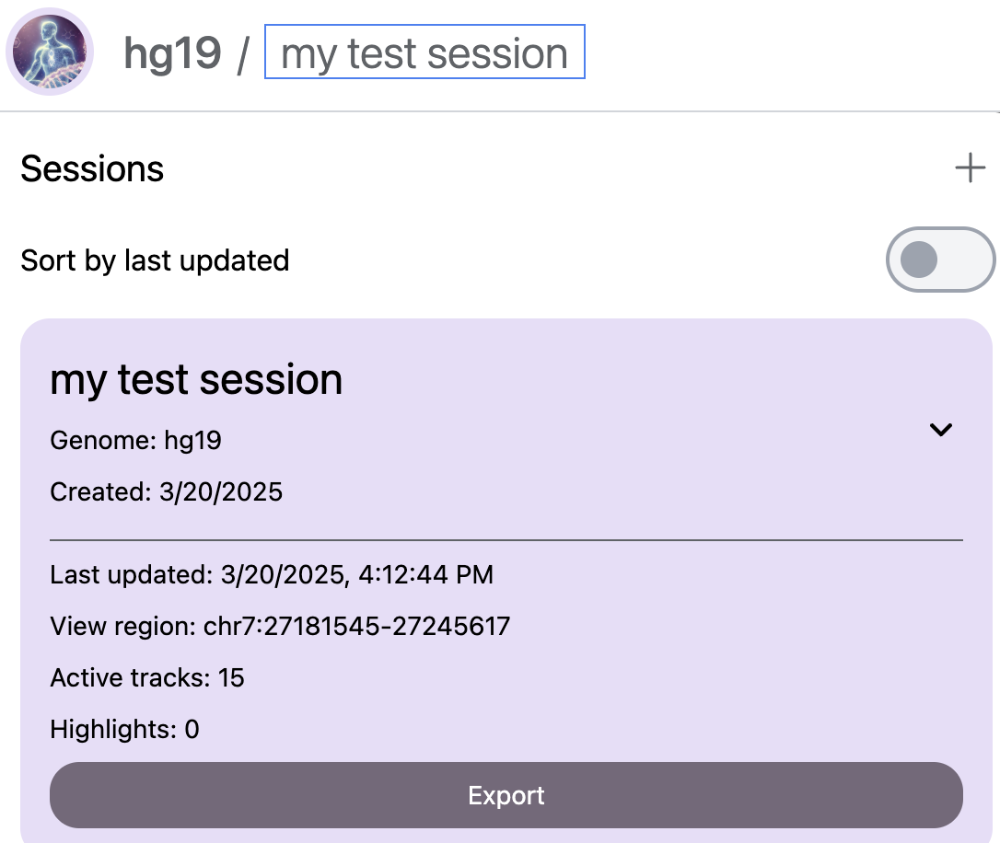
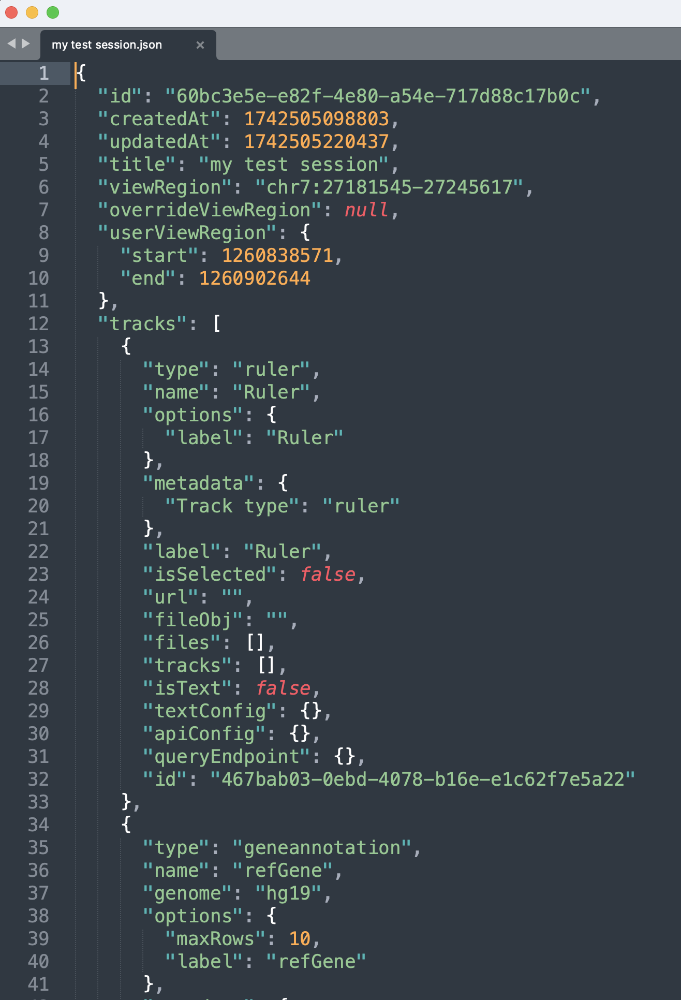
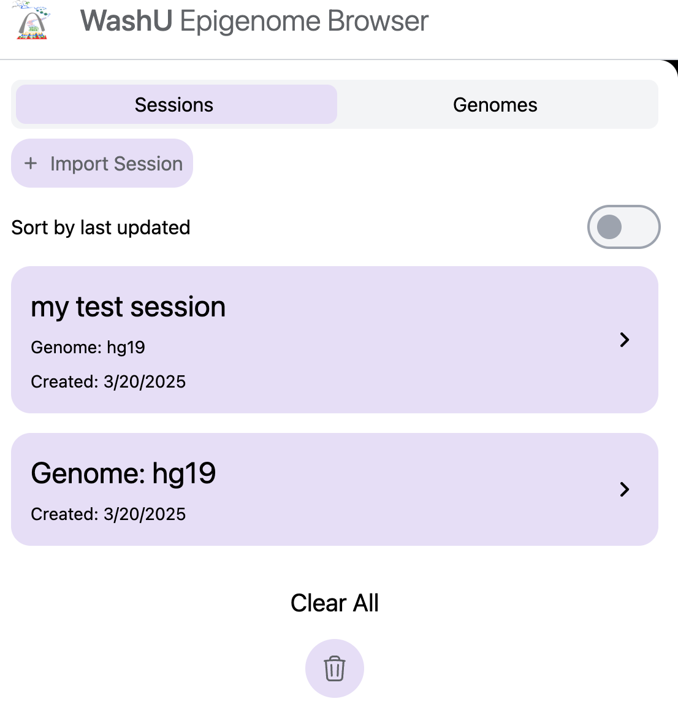
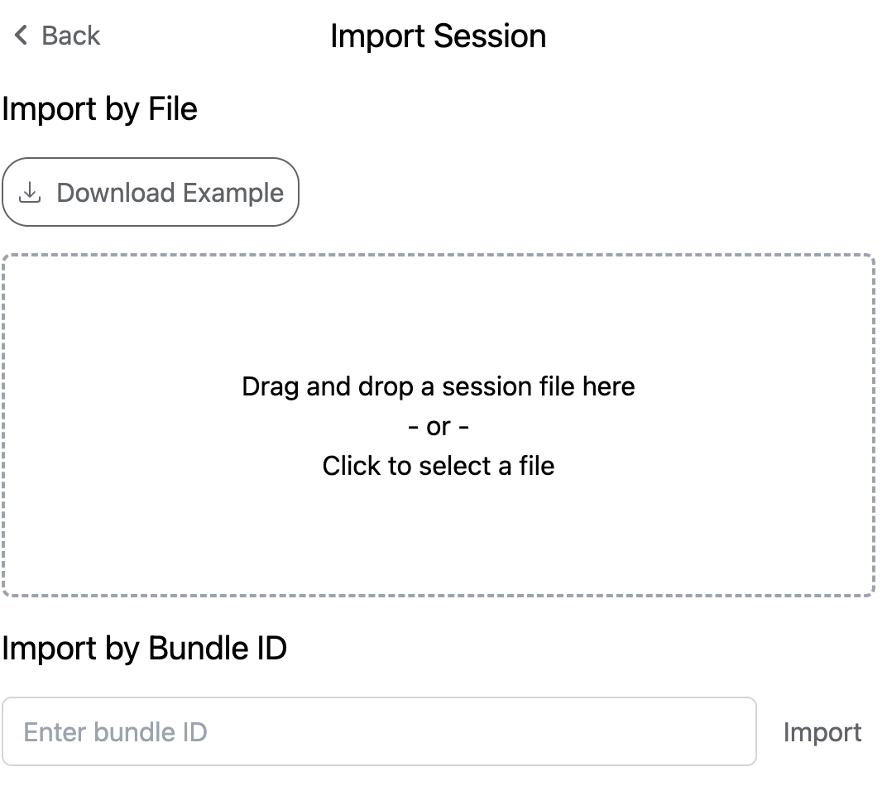
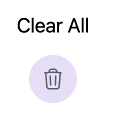
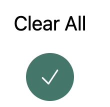

# Manage sessions

Sessions are used to quickly restore the view last time or be shared to collaborators or friends for the same visualization. Click the genome icon on the top left will open the Sessions panel:

Mouse over the session will show more detailed information about this session. Session can be Deleted, Exported for download as a JSON file or be duplicated as a copy.

Sessions can be renamed if you click the name next to the top genome icon, for example, I renamed it to `my test session`:

Click the `Export` button will download the session file as a JSON file:

Click the `+` icon will go to the panel with `Import Session` button:

Drag and drop the `my test session.json` file or manually upload it:

The previous session will be restored:

You can also remove all sessions by click the Clear All button, once you click it, a 3 seconds countdown will apear:

You need to **click again** the green check mark to remove all sessions. This ensures you won't accientally delete all your sessions.

