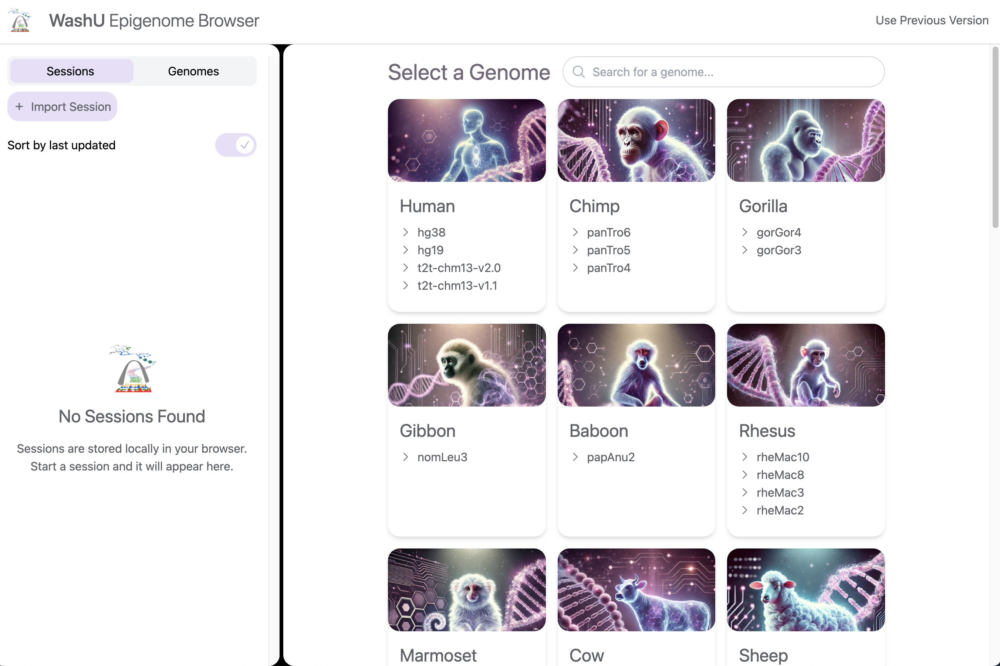
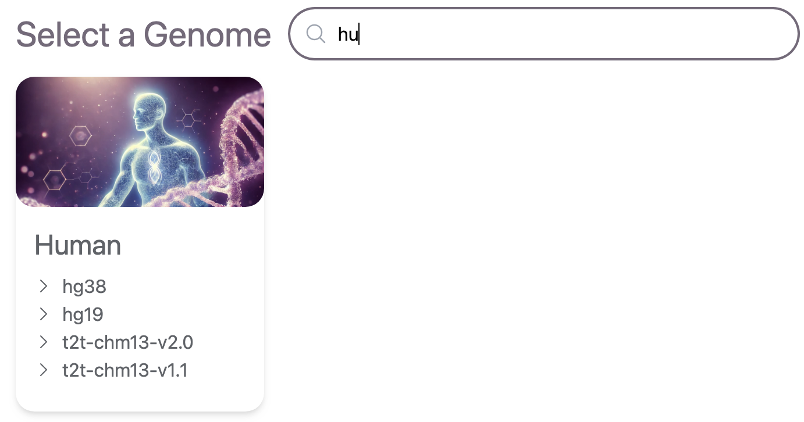

# Pick a genome

When you first open the Browser, the genome selection window will show up and allows you to select a genome to start.

You can type into the search bar for an instant search, genome names match your input will show up only.

Here, we clicked `hg19` and used the Human hg19 genome as an exmple.

